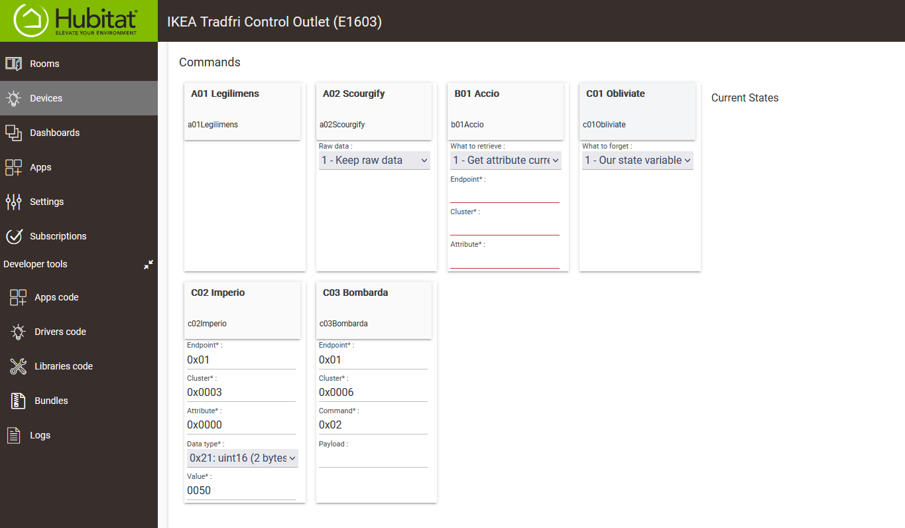
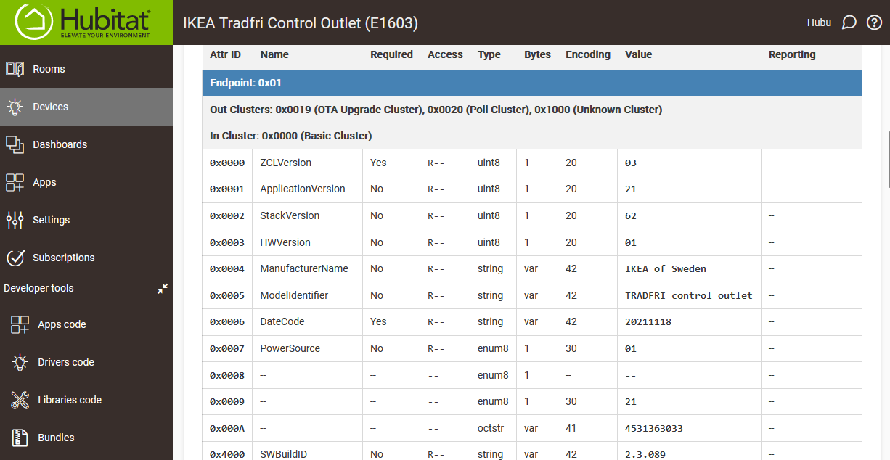

# Knockturn Alley

Simple toolkit driver to let developers peer deep into the guts of Zigbee devices.

**Note:** this driver is useless to end-users as it cannot control any smart device.

| Spells | Attributes Report |
|--------|-------------------|
|  |  |

> Skulking around Knockturn Alley? Dodgy place. Don't want no one to see you there. \
> -- Hagrid

## Spells
The following functionalities are currently implemented:
- [A01 - Legilimens](#a01---legilimens)
- [A02 - Scourgify](#a02---scourgify)
- [B01 - Revelio](#b01---revelio)
- [B02 - Obliviate](#b02---obliviate)

### A01 - Legilimens

The `Legilimens` spell will try to automatically discover all available attributes for a Zigbee device. When cast, it will:
1. Retrieve Zigbee endpoints (e.g.: 0x01 = Default endpoint)
2. For each endpoint, retrieve in and out clusters (e.g.: 0x0006 = On/Off Cluster)
3. For each in cluster, discover attributes (e.g.: 0x0400 = SWBuildID - for cluster 0x0000)
4. For each attribute, ask the device to send its current value
5. If an attribute is known to be reportable, ask the device to send its current reporting configuration

Before casting the spell, have the Logs section open in order to take a peak at the chatty conversation that the driver is having with the device. Be patient, the discovering process will take about 1 minute to finish (depending on the number of endpoints/clusters/attributes). Keep your eyes on the Logs to see when the driver stops adding log entries.

> **Important**: If the device is battery-powered, press any button to wake it before casting the `Legilimens` spell; then, keep on pressing buttons every second or so in order to prevent the device from going back to sleep.

When the discovery process is complete, refresh the device details page to see what data was gathered. This data will be hard to follow in its raw format, so you should continue with casting the next spell.

### A02 - Scourgify

The `Scourgify` spell will cleanup the data mess we got after casting the `Legilimens` spell. When cast, it will:
1. Read data that was gathered during the `Legilimens` spell. You need first cast the `Legilimens` otherwise nothing will happen.
2. Use the raw data to create a friendly attributes report.

After casting the spell, refresh the device details page to see the attributes report. Have fun!

### B01 - Revelio

The `Revelio` spell helps you reveal information for a specific Zigbee attribute. When cast, it can:
1. Read the current value of the attribute identified by the endpoint/cluster/attribute coordinates.
2. Read the reporting configuration for the attribute identified by the endpoint/cluster/attribute coordinates.

Before casting the spell, have the Logs section open in order to see the device response.

### B02 - Obliviate

The `Obliviate` spell is used when you want the driver to forget specific information present in the device details page. When cast, it can:
1. Our state variables (ka_*) - Remove only information that was added by this driver, so that you can go back to using the original driver.
2. All state variables - Remove all stored state data. You may use this if you want to switch drivers and start with a clean state.
3. Device data - Remove all information present in the `Device Details -> Data` section. Useful when switching drivers.
4. Scheduled jobs configured by the previous driver. Useful when switching drivers.
5. Everything - Forget everything, start anew.

After casting the spell, refresh the device details page to see that the specified information vanished into the void.

---

